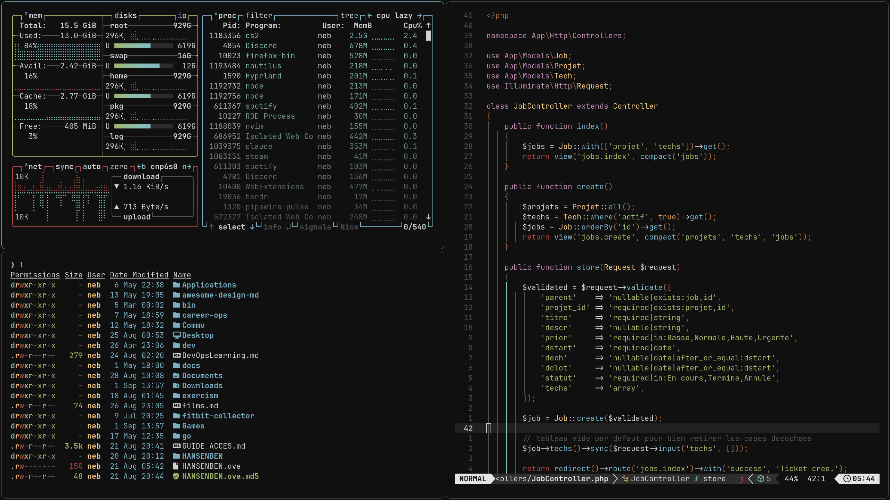

# Bark

An [Omarchy](https://omarchy.org/) theme based on the bark palette.



## Installation

```bash
omarchy theme install https://github.com/neben23/omarchy-bark-theme.git
```

## Colors

| Role | Color |
|---|---|
| Background | `#101010` |
| Foreground | `#d0d0d0` |
| Accent (blue) | `#7cafc2` |
| Red | `#ab4642` |
| Green | `#a1b56c` |
| Yellow | `#f7ca88` |
| Cyan | `#86c1b9` |
| Magenta | `#ba8baf` |

## Backgrounds

Three wallpapers included: `01-nature-of-fear.jpg`, `02-crowned.jpg`, and a plain `#101010` background (`03-black.png`).
